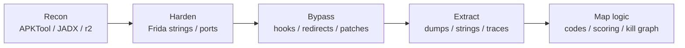
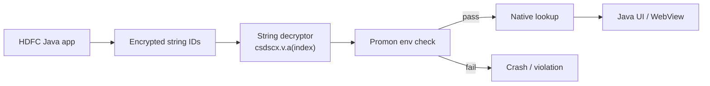
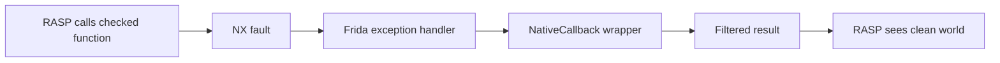
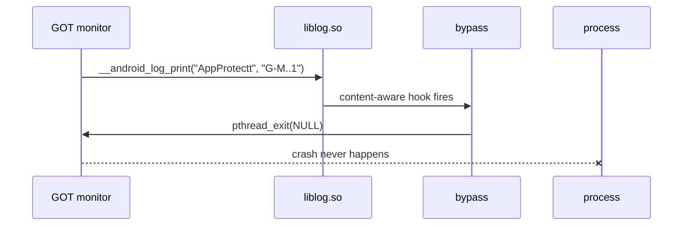

<div class="kicker">Android Runtime Protection Field Report</div>

# Dissecting Android RASP

## Promon Shield + RASP B + Protectt.ai

<div class="subtitle">
How three Android self-protection engines detect, decide, and fail differently.
</div>

<div class="meta-grid">
  Frida <span>·</span> r2 / JADX <span>·</span> Native ARM64 <span>·</span> Runtime bypass
</div>

<!--
Open by framing this as research and defense learning: the goal is to understand what modern Android RASP actually does under pressure.
-->

---
layout: statement
class: center
---

# RASP is not one check.

<div class="statement-sub">
It is a mesh of runtime assumptions: process shape, memory integrity, device truth, control flow, and kill semantics.
</div>

<!--
The central thesis: modern mobile RASP is a system, not a function. Bypassing it requires mapping the whole kill graph.
-->

---

<div class="section-label">00 / A Note On Demos</div>

# Why You Won't See A Live Demo

<div class="callout">
A live demo of any of these apps would be uneventful. You would either see a <b>"Root / Emulator / Tampered device detected"</b> dialog, or the process would simply crash on launch. That is the entire user-visible surface before the work begins.
</div>

<div class="clean-table">

| Without bypass | With bypass |
|---|---|
| dialog → countdown → process killed | normal app, all features reachable |
| native crash before first activity | stable, instrumentable runtime |
| nothing to inspect, nothing to learn | traffic capture, logic mapping, code recovery |

</div>

<div class="caption">
The interesting story is the reverse engineering itself: how each engine decides, how it kills, and what it takes to keep the process alive long enough to understand it. That is what this talk is about.
</div>

---

<div class="section-label">01 / Problem</div>

# What Runtime Application Self-Protection Watches

<div class="clean-table">

| Surface | What It Watches |
|---|---|
| **Device** | root, emulator, bootloader, properties |
| **Process** | Frida, Xposed, maps, threads, loaded modules |
| **Code** | GOT, PLT, prologues, text hashes, signatures |
| **Behavior** | debugger, syscalls, signals, watchdogs |

</div>

<div class="callout">
The failure mode is almost always simple: show warning, break crypto, kill thread, or kill process.
</div>

---

<div class="section-label">02 / Targets</div>

# Three Very Different RASPs

<div class="cards three">
  <div class="card accent-blue">
    <div class="eyebrow">RASP A</div>
    <h2>Promon Shield</h2>
    <p>Production banking app case study.</p>
    <ul>
      <li><code>com.snapwork.hdfc</code></li>
      <li><code>libnflaogabhnhi.so</code></li>
      <li>Packing, direct syscalls, Frida artifact checks</li>
    </ul>
  </div>
  <div class="card accent-green">
    <div class="eyebrow">RASP B</div>
    <h2>The Black Box</h2>
    <p>Heavyweight Android protection engine that hides almost everything about itself.</p>
    <ul>
      <li>ARM64-only native engine</li>
      <li>Thin JNI bridge fronts a multi-megabyte core</li>
      <li>Fake symbols, encrypted strings, direct syscalls</li>
    </ul>
  </div>
  <div class="card accent-amber">
    <div class="eyebrow">RASP C</div>
    <h2>Protectt.ai</h2>
    <p>Commercial SDK in a production banking app.</p>
    <ul>
      <li><code>com.equitas.elevate</code></li>
      <li>Protectt.ai SDK <code>v2.2.41</code></li>
      <li>Visible JNI exports, layered kill chain</li>
    </ul>
  </div>
</div>

<!--
RASP A demonstrates the classic production banking playbook. RASP B hides what it is doing. RASP C exposes more names but has a more redundant kill chain.
-->

---

<div class="section-label">03 / Method</div>

# The Five-Step Workflow



<div class="method-row">
  <span>Know the engine</span>
  <span>Hide the tools</span>
  <span>Break the kill path</span>
  <span>Recover the truth</span>
</div>

---
layout: default
class: collage-slide
---

# Step 2 — Hide The Tools

<div class="caption collage-caption">
Before any RASP-specific work, every fingerprint Frida ships with is rewritten in the server binary. Process names, thread names, file paths, env strings — replaced with random bytes. The protector now scans memory that no longer says what it expects. We use this for every RASP in this talk.
</div>

<div class="collage">
  <span class="chip" style="--x: 8%;  --y: 38%;  --r: -7deg;  --s: 1.20;">re.frida.server</span>
  <span class="chip" style="--x: 28%; --y: 32%;  --r: 4deg;   --s: 1.05;">frida-agent</span>
  <span class="chip" style="--x: 50%; --y: 36%;  --r: -3deg;  --s: 1.15;">frida-agent-64.so</span>
  <span class="chip" style="--x: 74%; --y: 32%;  --r: 8deg;   --s: 1.05;">frida-agent-32.so</span>
  <span class="chip" style="--x: 14%; --y: 50%;  --r: 3deg;   --s: 1.10;">frida-helper</span>
  <span class="chip" style="--x: 36%; --y: 47%;  --r: -10deg; --s: 1.30;">linjector</span>
  <span class="chip" style="--x: 60%; --y: 46%;  --r: 6deg;   --s: 1.10;">gum-js-loop</span>
  <span class="chip" style="--x: 84%; --y: 48%;  --r: -5deg;  --s: 1.05;">gum-exceptor-worker</span>
  <span class="chip" style="--x: 10%; --y: 62%;  --r: 9deg;   --s: 1.05;">gmain</span>
  <span class="chip" style="--x: 26%; --y: 65%;  --r: -4deg;  --s: 1.25;">"frida"</span>
  <span class="chip" style="--x: 44%; --y: 62%;  --r: 5deg;   --s: 1.10;">frida-main-loop</span>
  <span class="chip" style="--x: 64%; --y: 64%;  --r: -8deg;  --s: 1.05;">gdbus</span>
  <span class="chip" style="--x: 84%; --y: 64%;  --r: 3deg;   --s: 1.10;">pool-spawner</span>
  <span class="chip" style="--x: 12%; --y: 76%;  --r: -6deg;  --s: 1.15;">pipe-</span>
  <span class="chip" style="--x: 32%; --y: 80%;  --r: 7deg;   --s: 1.05;">FRIDA</span>
  <span class="chip" style="--x: 50%; --y: 76%;  --r: -3deg;  --s: 1.20;">GADGET</span>
  <span class="chip" style="--x: 68%; --y: 80%;  --r: 5deg;   --s: 1.10;">AGENT</span>
  <span class="chip" style="--x: 86%; --y: 78%;  --r: -7deg;  --s: 1.05;">gadget.so</span>
  <span class="chip" style="--x: 18%; --y: 90%;  --r: 4deg;   --s: 1.05;">-32.so</span>
  <span class="chip" style="--x: 38%; --y: 92%;  --r: -5deg;  --s: 1.10;">-64.so</span>
  <span class="chip" style="--x: 58%; --y: 90%;  --r: 8deg;   --s: 1.05;">/data/local/tmp</span>
  <span class="chip" style="--x: 80%; --y: 92%;  --r: -4deg;  --s: 1.10;">/Library/Caches</span>
  <span class="chip" style="--x: 92%; --y: 38%;  --r: -6deg;  --s: 1.05;">pool-%s</span>
  <span class="chip" style="--x: 4%;  --y: 24%;  --r: 6deg;   --s: 1.05;">-%u.so</span>
</div>

<div class="collage-stamp">PATCHED</div>

---

<div class="section-label">04 / Promon Shield</div>

# RASP A: Promon Shield on HDFC

<div class="profile-table">

| Field | Value |
|---|---|
| **Package** | `com.snapwork.hdfc` |
| **Version** | `11.2.3` |
| **Native library** | `libnflaogabhnhi.so` |
| **Architectures** | ARM, ARM64, x86 |

</div>

<div class="callout">
Objective: bypass hook and root detection, then capture network traffic for an Android banking app.
</div>

---

# Promon Recon

<div class="clean-table">

| Signal | Finding |
|---|---|
| Library inventory | <code>libnflaogabhnhi.so</code> across ARM/x86 variants |
| APKiD | <code>packer : Promon Shield</code> |
| Java layer | no heavy bytecode obfuscation, but strings are encrypted |
| String API | <code>Lcsdscx/v;->a(I)Ljava/lang/String;</code> |
| Native state | packed <code>.text</code>, useful logic hidden until runtime |

</div>

<!--
First lesson: do boring recon before running anything. Library names, APKiD output, and string access patterns already sketch the shape of the protector.
-->

---

# Promon Architecture



<div class="caption">
The string decryptor was also a gate: if the environment check failed, normal app code could not even resolve its strings safely.
</div>

---

# Promon Packed Native Layer

```text
JNI_OnLoad looked like data, not useful code.
.text: 0x55330 -> 0x4504E8
.init_array: sub_466F70
```

<div class="clean-table">

| Phase | Detail |
|---|---|
| **Static view** | packed and control-flow-obfuscated, poor signal in IDA at first |
| **Dynamic pivot** | wait for <code>android_dlopen_ext</code>, dump after runtime unpacking |
| **Repair** | run SoFixer on the dumped ELF to recover sections and analysis quality |

</div>

---

# Promon Dynamic Recon

<div class="clean-table">

| Hook / Trace | What It Revealed |
|---|---|
| <code>dlsym</code> | <code>fork</code>, <code>prctl</code>, <code>dl_iterate_phdr</code>, <code>syscall</code>, <code>__system_property_get</code> |
| <code>prctl</code> | <code>PR_SET_PTRACER</code>, dumpability checks, child-process anti-debug hints |
| <code>svc #0</code> scan | <code>faccessat</code>, <code>openat</code>, <code>ptrace</code>, <code>kill</code>, <code>exit_group</code>, <code>mprotect</code> |
| <code>mprotect</code> | permission flip to executable memory, hinting at a second unpacked region |

</div>

<div class="quote">
You don't need to deobfuscate Promon to understand it. You just need to be at the right hook when it talks to the kernel.
</div>

<!--
Static analysis got us to the point of "we know there is a packed library and a string decryptor", but we did not know what Promon actually does at runtime. So we switched to dynamic instrumentation and asked four questions in order.

First — what symbols is Promon resolving at runtime? We hooked dlsym, the libc function for looking up a symbol by name. Anything resolved through dlsym is a function the protector wants to call but does not want to advertise in its import table. The output is the top row: fork, prctl, dl_iterate_phdr, syscall, __system_property_get. That is already the shopping list of a RASP — fork a child, set process flags, walk loaded modules, make raw syscalls, read system properties.

Second — prctl was interesting, so we hooked it specifically. The arguments told us Promon is calling PR_SET_PTRACER and toggling dumpability. Translation: it is setting up anti-debug. Specifically, it is making sure no one else can ptrace the process and turning off core dumps. So we now know there is an anti-debug layer.

Third — and this is the important one — we scanned the unpacked memory for the byte pattern 01 00 00 d4. That is svc #0 in ARM64, the instruction that traps directly into the kernel. Every match is a place where Promon is making a syscall without going through libc, which means a normal libc-level Frida hook would never see it. We got hits on faccessat, openat, ptrace, kill, exit_group, mprotect — file checks, anti-debug, process termination, memory permission changes. That is the kill set.

Fourth — the mprotect hits were the giveaway. Promon was flipping memory permissions to executable in regions inside its own library. That only happens when you are about to run code you just unpacked. So even after we already dumped the library once, there is a second unpacked region we have not seen yet.

So in four hooks, with no offsets, no symbols, and no prior knowledge of the binary, we went from a packed black box to a clear picture: Promon resolves syscalls dynamically, blocks debuggers, talks to the kernel directly, and unpacks at least twice. That is the map we needed before patching anything.

If short on time: "Four hooks. dlsym to see what it resolves. prctl to confirm anti-debug. svc #0 scan to catch every direct syscall. mprotect to find a second unpacked region. No offsets needed."
-->

---

# Promon Detection Surface

<div class="clean-table">

| Category | Evidence |
|---|---|
| Frida files | <code>re.frida.server</code>, <code>frida-agent-64.so</code>, <code>linjector-1</code> |
| Frida memory | <code>/proc/self/maps</code>, <code>memfd:frida-agent</code>, module names |
| Thread names | <code>/proc/self/task/*/comm</code> for runtime thread artifacts |
| Root / Xposed | <code>/system/xbin/su</code>, Magisk/Riru/EdXposed paths, Substrate/Xposed files |
| APK integrity | reads <code>base.apk</code> and jumps to signing data |
| Network / SSL | certificate pinning needed separate handling |

</div>

---

# Promon Chain — Recon

<div class="clean-table">

| # | Step |
|---|---|
| **1** | Library inventory → `libnflaogabhnhi.so` flagged across all four ABIs |
| **2** | APKiD confirms `packer : Promon Shield` |
| **3** | Java strings only resolved via `Lcsdscx/v;->a(I)Ljava/lang/String;` |
| **4** | IDA: `.text` packed, `JNI_OnLoad` is data, only `.init_array → sub_466F70` is real |
| **5** | Hook `android_dlopen_ext` and dump the unpacked library at runtime |

</div>

---

# Promon Chain — Trace

<div class="clean-table">

| # | Step |
|---|---|
| **6** | Repair the dump with `SoFixer64` (sections, relocations, PLT) |
| **7** | Hook `dlsym` → `fork`, `prctl`, `dl_iterate_phdr`, `syscall`, `__system_property_get` |
| **8** | Hook `prctl` → `PR_SET_PTRACER`, `PR_GET_DUMPABLE`, `PR_SET_DUMPABLE` (anti-debug) |
| **9** | Memory-scan `01 00 00 d4`, attach on every `svc #0` site |
| **10** | Parse syscall args: `openat` / `faccessat` / `readlinkat` / `lseek` / `fstatat` / `mprotect` |
| **11** | On `mprotect(prot=0x5)`, snapshot the second-stage unpacked region |

</div>

---

# Promon Chain — Patch & Capture

<div class="clean-table">

| # | Step |
|---|---|
| **12** | Hook `sub_3430` (centralised `char*` handler) to print live strings |
| **13** | Patch Frida server strings: `re.frida.server`, `frida-agent`, `linjector`, `gum-js-loop`, ... |
| **14** | Run patched server on a non-default port — `27042` no longer fingerprints |
| **15** | Hook `csdscx.v.a(int)` → map `0x3985 Rooting Detected`, `0x3996 ADB Violation` |
| **16** | Patch Java callbacks: `csdscx.g.d() → false` (root), `csdscx.l.a() → false` (ADB) |
| **17** | SSL unpinning bundle → Burp captures traffic |

</div>

---

# Promon Result

<div class="clean-table">

| Outcome | Detail |
|---|---|
| **2 packing layers** | observed via runtime unpacking and SoFixer repair |
| **`svc #0` tracing** | mapped detection checks across the unpacked region |
| **Frida hardened** | patched artifacts and ran the server on a non-default port |
| **Burp capture** | achieved after Java root/ADB callbacks returned `false` and SSL pinning was neutralised |

</div>

<div class="callout">
"The fastest path was not fully deobfuscating Promon. It was dumping the runtime truth and following the enforcement callbacks."
</div>

---

<div class="section-label">05 / RASP B</div>

# RASP B: The Black Box

<div class="profile-table">

| Field | Value |
|---|---|
| **Distribution** | Android-only, ARM64-only |
| **Surface** | thin JNI bridge in front of a multi-megabyte native engine |
| **Java side** | minimal, real logic lives in native |
| **Engine size** | ~19 MB of obfuscated `.text` |

</div>

<!--
RASP B behaves like a serious commercial RASP: large native engine, encrypted strings, anti-analysis logic spread across many init functions.
-->

---

# RASP B Architecture

<div class="clean-table">

| Layer | Role |
|---|---|
| **App layer** | host activity, minimal Java footprint |
| **App bootstrap** | loads the native bridge during process init |
| **JNI bridge** (~140 KB) | thin Java ↔ native surface, almost no logic |
| **RASP engine** (~19 MB) | detection, scoring, and kill orchestration |

</div>

<div class="clean-table">

| Engine Output | Role |
|---|---|
| **ChaCha20 strings** | decrypts opaque vendor-tagged constants at runtime |
| **Detection scoring** | 37 mapped codes across 7 categories |
| **Kill path** | system alert dialog, timer, process termination |

</div>

<div class="caption">
The small library is the bridge. The large library is the actual battlefield.
</div>

---

# Native Structure

<div class="terminal-card">

| Section | Size | Meaning |
|---|---:|---|
| <code>.text</code> | 15.3MB | heavily obfuscated code |
| <code>.rodata</code> | 1.6MB | encrypted constants and runtime data |
| <code>.data</code> | 356KB | mutable state |
| <code>.init_array</code> | 816B | roughly 102 init functions |

</div>

<div class="callout">
Exports masquerade as fake C++ <code>boost::</code> symbols. The main init function alone is about 1.05MB.
</div>

---

# RASP B's Anti-Analysis Stack

<div class="clean-table">

| Protection | What It Does |
|---|---|
| **String encryption** | vendor-tagged ciphertext blobs, native ChaCha20 decryptors |
| **Control-flow flattening** | large switch dispatchers that break decompilation |
| **Signal traps** | intentional faults, custom handlers, link-register tricks |
| **Module enumeration** | <code>dl_iterate_phdr</code>, maps, Frida module filtering |
| **Prologue scanning** | reads libc bytes to catch Interceptor trampolines |
| **Direct syscalls** | 621 aligned <code>svc #0</code> instructions |

</div>

---

# Detection Taxonomy

<div class="clean-table taxonomy-table">

| Count | Category |
|---:|---|
| **02** | Root & binary |
| **07** | Bootloader |
| **10** | TEE |
| **05** | Injection |
| **04** | Modules |
| **06** | Process anomalies |
| **03** | Environment spoofing |

</div>

<div class="big-number small">
  <span>37</span>
  <p>unique detection codes mapped</p>
</div>

---

# The Wrong Move

```javascript
Interceptor.attach(Module.findExportByName("libc.so", "open"), {
  onEnter(args) {
    // Looks useful. Also leaves a trampoline.
  }
})
```

<div class="danger">
Modern RASPs read function prologues. A classic hook becomes evidence.
</div>

<!--
This is the turning point of the RASP B story: normal Frida hooks make the detector more confident.
-->

---

# The Winning Pattern: Zero Libc Hooks

<div class="split">
  <div>
    <h3>Do not patch libc</h3>
    <p>Let the detector inspect clean bytes.</p>
  </div>
  <div>
    <h3>Redirect on exception</h3>
    <p>Use NX faults and <code>NativeCallback</code> wrappers as the control plane.</p>
  </div>
</div>

```javascript
Process.setExceptionHandler(function(details) {
  // Route known NX faults to filtered wrappers.
  return handled;
})
```

<div class="callout">
Why it works: the RASP scans the first bytes of libc functions for hook trampolines. We never write any — the redirect lives in the page-fault path, not in the prologue. The detector reads pristine libc and walks away.
</div>

<!--
Why this trick beats the detector, in slow form:

RASP B's anti-analysis loop reads function prologues — the first few instructions of libc functions like open, exit, kill — looking for the byte pattern Frida's Interceptor.attach writes when it patches a function. If those bytes look like a trampoline (e.g. an unconditional branch to Frida's code cage), the detector concludes the process is hooked and kills it.

A "zero-libc-hook" bypass never writes those bytes. Instead it redirects at the call site: the GOT entry for the function is pointed at a non-executable page. When the RASP calls the function, the CPU raises an NX (no-execute) fault. Frida's exception handler catches that fault, runs a NativeCallback wrapper with the result we want the RASP to see, and returns control. From the kernel's point of view this is just a recoverable page fault. From the RASP's point of view the libc bytes are still pristine and the call returned a clean answer.

So the bypass moves out of the prologue, into the page-fault path. The detector has nothing to scan.

One sentence: we replaced "patch the function" with "fault on the call", and faults do not leave fingerprints in the bytes the detector reads.
-->

---

# RASP B Bypass Shape



<div class="clean-table">

| Component | Purpose |
|---|---|
| **Cloak** | hide Frida ranges and threads |
| **Properties** | spoof emulator fields to Pixel-like values |
| **Java** | neutralize alert and kill process paths |

</div>

---

# RASP B Result

<div class="clean-table">

| Outcome | Detail |
|---|---|
| **Analysis window** | reliable runtime instrumentation without immediate termination |
| **20 MB dump** | full native engine recovered for offline analysis |
| **40+ strings** | ChaCha20-decrypted constants captured at runtime |
| **37 detection codes** | mapped across 7 categories (root, bootloader, TEE, injection, modules, process, environment) |

</div>

<div class="quote">
"If you never touch libc, the RASP cannot see your fingerprints there. Direct syscalls still demand a separate strategy."
</div>

---

<div class="section-label">06 / Protectt.ai</div>

# Protectt.ai: The Layered Kill Chain

<div class="profile-table">

| Field | Value |
|---|---|
| **Package** | `com.equitas.elevate` |
| **SDK** | Protectt.ai `v2.2.41` |
| **App** | Flutter split APK |
| **Native** | `libapp-protectt-native-lib.so`, `libprotectt-native-lib.so` |

</div>

<div class="callout amber">
RASP B hid intent. RASP C exposed names, but made termination redundant.
</div>

---

# Protectt.ai Architecture

<div class="clean-table">

| Layer | Role |
|---|---|
| **Flutter app** | `com.equitas.elevate` user surface |
| **Java** | `ScanAlerts` / `ScanUtils` orchestrate dialog, countdown, kill |
| **JNI bridge** | `libapp-protectt-native-lib.so` exposes `Java_ai_protectt_*` |
| **Core RASP** | `libprotectt-native-lib.so` runs Frida / root / emulator / debugger checks |
| **Watchdog** | GOT integrity monitor logs `G-M..1`, forces `SIGSEGV` |
| **Kill paths** | `CloseApplication`, `abort`, `exit_group` (redundant) |

</div>

---

# The Names Were Visible

```text
Java_ai_protectt_app_security_main_scan_ScanUtils_isHookingTracess
_Z15findFridaServerv
_Z10check_mapsv
CloseApplication
Frida    @ .data
HooKing  @ .data
```

<div class="caption">
Plaintext exports made recon faster. They did not make the bypass simple.
</div>

---

# The Java Kill Chain

<div class="clean-table">

| Step | Action |
|---|---|
| **1. `ScanAlerts.showAlert`** | detection dialog is raised |
| **2. `CountDownTimer.onFinish`** | countdown expires; two parallel kill paths fire |
| **3a. `ScanAlerts.m` → `T`** | `finish()` + `Process.killProcess(myPid)` |
| **3b. `ScanAlerts.t` → `s`** | wraps `System.exit(0)` |
| **4. `RuntimeException`** | thrown if `System.exit` ever returns |

</div>

<div class="danger">
Naive <code>System.exit -> return</code> is detected by design.
</div>

---

# Five Ways To Die

<div class="clean-table">

| Layer | Mechanism |
|---|---|
| **Layer 1** | Java `System.exit` followed by an anti-return exception if it ever returns |
| **Layer 2** | Java `Process.killProcess` fired from alert dialog callbacks |
| **Layer 3** | Native `abort` / `exit` resolved through the GOT |
| **Layer 4** | Native `syscall(exit_group)` direct termination via libc wrapper |
| **Layer 5** | GOT integrity monitor logs the violation, then forces `SIGSEGV` |

</div>

---

# Why "Just RET" Failed

```text
abort() and exit() are noreturn.

If they suddenly return:
  caller falls through into compiler garbage
  -> invalid control flow
  -> crash
```

<div class="callout">
The fix was not "return". It was "kill only the detection thread".
</div>

---

# Code Islands

```javascript
// redirect noreturn kills to pthread_exit(NULL)
var trampoline = Memory.alloc(24)
trampoline.writeByteArray([
  0x00, 0x00, 0x80, 0xD2, // MOV X0, #0
  0x41, 0x00, 0x00, 0x58, // LDR X1, [PC, #8]
  0x20, 0x00, 0x1F, 0xD6  // BR X1
])
trampoline.add(12).writePointer(pthread_exit)
```

<div class="caption">
Process survives because the calling detection thread exits cleanly.
</div>

---

# The Breakthrough: Log Trip-Wire



<div class="quote amber">
The monitor announced the crash before triggering it.
</div>

---

# Protectt.ai Bypass Shape

<div class="clean-table">

| Stage | Action |
|---|---|
| **Stage 0** | Build return-false and pthread-exit code islands |
| **Stage 1** | Install exception handler for protectt/perfetto faults |
| **Stage 2** | Block fatal libc signal and syscall paths |
| **Stage 3** | Patch GOT entries despite RELRO with <code>Memory.protect</code> |
| **Stage 4** | Patch native detection functions to false |
| **Stage 5** | Neutralize Java ScanAlerts kill chain |

</div>

---

# Protectt.ai Result

<div class="clean-table">

| Outcome | Detail |
|---|---|
| **5 / 5 Java kill paths blocked** | `System.exit`, `Process.killProcess`, anti-return exception, `ScanAlerts.T`, `ScanAlerts.s` |
| **28+ native checks patched** | Frida, root, emulator, debugger, and integrity functions returned safe values |
| **GOT monitor neutralised** | watchdog thread killed via log trip-wire and `pthread_exit` |
| **4 min+ process survival** | observed under continuous detection load |

</div>

<div class="callout amber">
The detection dialog could appear, but the countdown and close-app path no longer controlled process death.
</div>

---

<div class="section-label">07 / Contrast</div>

# Three RASPs, Three Failure Modes

<div class="compare">

| Dimension | Promon Shield | RASP B | Protectt.ai |
|---|---|---|---|
| Intent visibility | packed native + encrypted strings | fake symbols, encrypted strings | plaintext JNI exports |
| Main difficulty | unpacking and artifact discovery | hiding from byte/prologue scans | defeating redundant kill layers |
| Syscalls | direct <code>svc #0</code> plus libc resolution | 621 direct <code>svc #0</code> sites | libc <code>syscall()</code> import |
| Integrity check | Frida/root/artifact checks, APK certificate reads | prologue and module scanning | GOT monitor thread |
| Winning idea | runtime dump + Frida artifact hardening | zero-libc-hook NX redirects | log trip-wire + thread kill |

</div>

---

# What Changed Between Them

<div class="timeline three">
  <div>
    <span>Promon</span>
    <p>The RASP asks: "Can I recognize your toolchain?"</p>
  </div>
  <div>
    <span>RASP B</span>
    <p>The RASP asks: "Can I see your hook?"</p>
  </div>
  <div>
    <span>Protectt.ai</span>
    <p>The RASP asks: "Did every kill path fail?"</p>
  </div>
</div>

<div class="statement-sub">
The defensive model evolves from artifact checks, to hook visibility checks, to redundant kill semantics.
</div>

---

# Technical Verification Pass

<div class="clean-table">

| Claim Area | Status |
|---|---|
| **Promon Shield** | Library inventory, APKiD result, runtime dump, SoFixer, `dlsym`/`prctl`/`svc #0` tracing, Frida hardening, root/ADB callbacks, SSL interception |
| **RASP B** | Architecture, ChaCha20 strings, 37 detection codes, prologue scanning, 621 direct syscalls, NX-fault redirect bypass — survival described as a stable analysis window |
| **Protectt.ai** | SDK version, JNI exports, Java anti-return, GOT monitor, `pthread_exit` code islands, log trip-wire, five-layer bypass |
| **Scope** | Slides cover findings and methodology; concrete offsets and scripts stay in the source notes |

</div>

---

# Practical Lessons

<div class="clean-table">

| # | Lesson |
|---:|---|
| **1** | Map the kill graph before writing the bypass. |
| **2** | Do not assume a visible symbol means a weak protector. |
| **3** | Hook visibility matters as much as hook correctness. |
| **4** | <code>noreturn</code> semantics matter in native bypasses. |
| **5** | Logs, watchdogs, and side channels often reveal timing windows. |

</div>

---

# Reversing An Unknown RASP Next Time

<div class="clean-table">

| Step | What To Do |
|---|---|
| **1. Inventory** | APKs, splits, native libs, DEX count, packer signatures, suspicious class prefixes |
| **2. Baseline** | run untouched: process lifetime, dialogs, logs, child processes, network behaviour |
| **3. Harden tools** | patch Frida artifacts, change ports, avoid noisy libc hooks |
| **4. Trace early** | constructors, `JNI_OnLoad`, `android_dlopen_ext`, `dlsym`, `prctl`, `svc #0` |
| **5. Split roles** | separate who detects, who reports, and who actually kills |
| **6. Probe + listen** | runtime dumps and string decryptors before static patches; treat logs and watchdog timing as side channels |

</div>

---

# What We Learned From All Three

<div class="clean-table">

| Theme | Lesson |
|---|---|
| **Artifacts still matter** | Promon showed that filenames, ports, threads, and maps remain high-signal. |
| **Hook stealth matters more** | RASP B showed that correct hooks fail if the RASP can see the trampoline. |
| **Kill semantics matter** | Protectt.ai showed that bypassing detection is not enough if another layer can still terminate. |
| **Runtime truth beats static guesses** | Dumping, tracing, and decrypting at runtime consistently produced the clearest model. |

</div>

---

# If You Build RASP

<div class="clean-table">

| Principle | Why |
|---|---|
| **Make state inseparable** | Do not keep protection as a detachable guard. |
| **Avoid single kill paths** | Redundancy forced the Protectt.ai bypass to become multi-layered. |
| **Protect the monitors** | Watchdogs need their own anti-tamper story. |
| **Watch your observability** | Useful logs can become attacker timing signals. |

</div>

---
layout: end
class: center
---

# The goal is not to break apps.

<div class="statement-sub">
It is to understand the protection landscape well enough to build and review stronger systems.
</div>

<div class="end-mark">RASP FIELD REPORT / END</div>

---

# Appendix: Demo Flow

<div class="clean-table">

| Demo | What To Show |
|---|---|
| **Promon recon** | APKiD, packed library, and SVC trace findings |
| **RASP B recon** | native libs and fake exports |
| **RASP B bypass** | run the zero-libc-hook bypass, capture decrypted strings |
| **Protectt recon** | plaintext JNI exports and ScanAlerts chain |
| **Protectt bypass** | run <code>nuclear.js</code>, show trip-wire log |
| **Comparison** | explain why the bypasses look different |

</div>

---

# Appendix: Speaker Notes Checklist

- Start with authorization and research framing.
- Keep demo offsets out of the verbal narrative unless the audience asks.
- Emphasize methodology over vendor callouts.
- Explain that Promon's core lesson is runtime unpacking plus artifact hygiene.
- Explain that RASP B's core lesson is hook invisibility.
- Explain that Protectt.ai's core lesson is layered kill semantics.
- Close on defensive design lessons.

<style>
:root {
  --bg: #070a0f;
  --panel: rgba(17, 24, 39, 0.74);
  --panel-strong: rgba(10, 15, 24, 0.94);
  --text: #e5e7eb;
  --muted: #94a3b8;
  --line: rgba(148, 163, 184, 0.25);
  --green: #2df8a8;
  --amber: #ffb454;
  --red: #ff5d73;
  --blue: #78a8ff;
}

.slidev-layout {
  background:
    radial-gradient(circle at 18% 18%, rgba(45, 248, 168, 0.11), transparent 28rem),
    radial-gradient(circle at 84% 70%, rgba(255, 180, 84, 0.09), transparent 24rem),
    linear-gradient(135deg, #05070b 0%, #07111d 50%, #0a0b10 100%);
  color: var(--text);
  font-family: "Avenir Next", "Futura", "Gill Sans", sans-serif;
}

.slidev-layout::before {
  content: "";
  position: absolute;
  inset: 0;
  pointer-events: none;
  background-image:
    linear-gradient(rgba(255,255,255,0.025) 1px, transparent 1px),
    linear-gradient(90deg, rgba(255,255,255,0.025) 1px, transparent 1px);
  background-size: 42px 42px;
  mask-image: radial-gradient(circle at center, black, transparent 78%);
}

h1, h2, h3 {
  letter-spacing: -0.04em;
  font-weight: 800;
}

h1 {
  font-size: 3.4rem;
  line-height: 0.95;
}

h2 {
  color: var(--muted);
}

code, pre {
  font-family: "SF Mono", "JetBrains Mono", "Menlo", monospace;
}

pre {
  border: 1px solid var(--line);
  border-radius: 18px;
  background: rgba(2, 6, 12, 0.8) !important;
  box-shadow: 0 30px 90px rgba(0,0,0,0.35);
}

table {
  width: 100%;
  font-size: 0.82rem;
}

.clean-table {
  margin-top: 1.4rem;
  border: 1px solid var(--line);
  border-radius: 22px;
  overflow: hidden;
  background: var(--panel);
  box-shadow: 0 22px 70px rgba(0,0,0,0.22);
}

.clean-table table {
  margin: 0;
  font-size: 1.02rem;
}

.clean-table th,
.clean-table td {
  padding: 0.85rem 1rem;
}

.clean-table td:first-child,
.clean-table th:first-child {
  width: 26%;
  color: var(--green);
  white-space: nowrap;
}

.taxonomy-table {
  max-width: 620px;
}

th {
  color: var(--green);
}

td, th {
  border-color: var(--line) !important;
}

.kicker,
.section-label,
.eyebrow,
.label {
  color: var(--green);
  text-transform: uppercase;
  letter-spacing: 0.18em;
  font-size: 0.72rem;
  font-weight: 800;
}

.subtitle {
  margin-top: 1.3rem;
  color: var(--muted);
  font-size: 1.3rem;
  max-width: 720px;
}

.meta-grid {
  position: absolute;
  bottom: 3.2rem;
  left: 3.8rem;
  border: 1px solid var(--line);
  border-radius: 999px;
  padding: 0.48rem 0.9rem;
  color: var(--muted);
  background: rgba(255,255,255,0.04);
  font-size: 0.82rem;
  word-spacing: 0.28rem;
}

.meta-grid span {
  color: var(--green);
}

.method-row span {
  border: 1px solid var(--line);
  border-radius: 999px;
  padding: 0.38rem 0.75rem;
  color: var(--muted);
  background: rgba(255,255,255,0.04);
  font-size: 0.78rem;
}

.statement-sub {
  max-width: 760px;
  margin: 1.5rem auto 0;
  color: var(--muted);
  font-size: 1.35rem;
  line-height: 1.35;
}

.watch-grid,
.cards,
.profile,
.result-grid,
.kill-grid,
.builder-grid,
.demo-grid,
.artifact-list,
.lessons {
  display: grid;
  gap: 1rem;
}

.watch-grid {
  grid-template-columns: repeat(2, 1fr);
  margin-top: 2rem;
}

.watch-grid div,
.card,
.profile div,
.stack div,
.kill-grid div,
.builder-grid div,
.artifact-list div,
.lessons div,
.demo-grid div {
  border: 1px solid var(--line);
  border-radius: 22px;
  background: var(--panel);
  padding: 1rem;
  box-shadow: 0 22px 70px rgba(0,0,0,0.22);
}

.watch-grid b,
.stack b,
.kill-grid b,
.builder-grid b,
.lessons b,
.demo-grid b {
  color: var(--text);
  display: block;
  margin-bottom: 0.4rem;
}

.watch-grid span,
.card p,
.card li,
.profile span,
.stack span,
.kill-grid span,
.builder-grid span,
.artifact-list span,
.lessons span,
.demo-grid span,
.caption,
.callout {
  color: var(--muted);
}

.cards.two {
  grid-template-columns: repeat(2, 1fr);
}

.cards.three {
  grid-template-columns: repeat(3, 1fr);
}

.cards.three .card {
  padding: 0.85rem;
}

.cards.three .card h2 {
  font-size: 1.35rem;
}

.cards.three .card p,
.cards.three .card li {
  font-size: 0.78rem;
}

.compact .card {
  min-height: 110px;
}

.card h2 {
  color: var(--text);
  margin: 0.35rem 0;
}

.accent-green {
  border-color: rgba(45,248,168,0.45);
}

.accent-amber {
  border-color: rgba(255,180,84,0.45);
}

.accent-blue {
  border-color: rgba(120,168,255,0.45);
}

.callout {
  margin-top: 1.4rem;
  border-left: 3px solid var(--green);
  padding: 0.9rem 1rem;
  background: rgba(45,248,168,0.06);
  border-radius: 0 16px 16px 0;
}

.callout.amber,
.quote.amber {
  border-color: var(--amber);
  background: rgba(255,180,84,0.08);
}

.danger {
  margin-top: 1rem;
  border: 1px solid rgba(255,93,115,0.5);
  border-radius: 18px;
  padding: 1rem;
  color: #ffd5dc;
  background: rgba(255,93,115,0.08);
}

.profile {
  grid-template-columns: repeat(4, 1fr);
  margin-top: 1.8rem;
}

.big-number {
  margin-top: 2rem;
  border: 1px solid var(--line);
  border-radius: 28px;
  padding: 1.3rem;
  max-width: 340px;
  background: var(--panel-strong);
}

.big-number span {
  color: var(--green);
  font-size: 4rem;
  line-height: 1;
  font-weight: 900;
  letter-spacing: -0.08em;
}

.big-number.small span {
  font-size: 3.4rem;
}

.big-number p {
  margin: 0.2rem 0 0;
  color: var(--muted);
}

.terminal-card {
  border: 1px solid var(--line);
  border-radius: 22px;
  padding: 1rem;
  background: rgba(0,0,0,0.28);
}

.stack {
  display: grid;
  gap: 0.65rem;
  margin-top: 1.2rem;
}

.stack div {
  display: grid;
  grid-template-columns: 180px 1fr;
  align-items: center;
}

.arch-flow {
  display: grid;
  grid-template-columns: 1.15fr auto 1.25fr auto 1.15fr auto 1.25fr;
  gap: 0.65rem;
  align-items: stretch;
  margin-top: 1.5rem;
}

.arch-card,
.arch-outputs div {
  border: 1px solid var(--line);
  border-radius: 20px;
  background: var(--panel);
  padding: 1rem;
  box-shadow: 0 22px 70px rgba(0,0,0,0.22);
}

.arch-card b,
.arch-outputs b {
  display: block;
  margin-bottom: 0.35rem;
  color: var(--text);
}

.arch-card span,
.arch-outputs span {
  color: var(--muted);
  font-size: 0.82rem;
}

.arch-arrow {
  display: grid;
  place-items: center;
  color: var(--green);
  font-size: 1.8rem;
  font-weight: 900;
}

.arch-outputs {
  display: grid;
  grid-template-columns: repeat(3, 1fr);
  gap: 0.8rem;
  margin-top: 1.2rem;
}

.taxonomy {
  display: grid;
  grid-template-columns: repeat(3, 1fr);
  gap: 0.8rem;
  margin-top: 1.4rem;
}

.taxonomy div {
  border: 1px solid var(--line);
  border-radius: 18px;
  padding: 1rem;
  background: var(--panel);
}

.taxonomy span {
  color: var(--green);
  font-size: 1.7rem;
  font-weight: 900;
  margin-right: 0.55rem;
}

.split {
  display: grid;
  grid-template-columns: repeat(2, 1fr);
  gap: 1rem;
  margin: 1.5rem 0;
}

.split div {
  border-top: 2px solid var(--green);
  background: var(--panel);
  border-radius: 0 0 22px 22px;
  padding: 1rem;
}

.method-row {
  display: flex;
  gap: 0.6rem;
  margin-top: 1rem;
}

.result-grid,
.kill-grid,
.builder-grid,
.lessons {
  grid-template-columns: repeat(2, 1fr);
  margin-top: 1.4rem;
}

.result-grid span {
  display: block;
  color: var(--green);
  font-size: 2.4rem;
  font-weight: 900;
  letter-spacing: -0.06em;
}

.result-grid p {
  margin: 0;
  color: var(--muted);
}

.quote {
  margin-top: 1.4rem;
  border: 1px solid rgba(45,248,168,0.35);
  border-radius: 22px;
  padding: 1.2rem;
  font-size: 1.35rem;
  color: var(--text);
  background: rgba(45,248,168,0.07);
}

.kill-grid b,
.lessons b {
  color: var(--amber);
  font-size: 1.5rem;
}

.compare {
  font-size: 0.8rem;
}

.timeline {
  display: grid;
  grid-template-columns: repeat(2, 1fr);
  gap: 1rem;
  margin-top: 1.8rem;
}

.timeline.three {
  grid-template-columns: repeat(3, 1fr);
}

.timeline.three p {
  font-size: 0.92rem;
}

.timeline div {
  border: 1px solid var(--line);
  border-radius: 28px;
  padding: 1.4rem;
  background: var(--panel-strong);
}

.timeline span {
  color: var(--green);
  font-size: 2rem;
  font-weight: 900;
}

.profile-table {
  margin-top: 1.6rem;
  border: 1px solid var(--line);
  border-radius: 22px;
  overflow: hidden;
  background: var(--panel);
  box-shadow: 0 22px 70px rgba(0,0,0,0.22);
  max-width: 760px;
}

.profile-table table {
  margin: 0;
  font-size: 1.02rem;
}

.profile-table th,
.profile-table td {
  padding: 0.85rem 1.1rem;
}

.profile-table td:first-child,
.profile-table th:first-child {
  width: 32%;
  color: var(--green);
  white-space: nowrap;
}

.vflow {
  display: flex;
  flex-direction: column;
  align-items: center;
  gap: 0.45rem;
  margin-top: 1rem;
}

.vflow-row {
  display: flex;
  gap: 1rem;
  width: 100%;
  justify-content: center;
}

.vflow-row.vflow-fanout {
  align-items: stretch;
}

.vflow-fanout > .vflow-card,
.vflow-fanout > .vflow-branch {
  flex: 1 1 0;
  max-width: 320px;
}

.vflow-branch {
  display: flex;
  flex-direction: column;
  align-items: stretch;
  gap: 0.4rem;
}

.vflow-card {
  border: 1px solid var(--line);
  border-radius: 18px;
  background: var(--panel);
  padding: 0.75rem 1rem;
  box-shadow: 0 18px 50px rgba(0,0,0,0.22);
  min-width: 260px;
  text-align: center;
}

.vflow-card b {
  display: block;
  color: var(--text);
  font-size: 1rem;
  margin-bottom: 0.25rem;
}

.vflow-card span {
  color: var(--muted);
  font-size: 0.82rem;
}

.vflow-card.accent-blue {
  border-color: rgba(120,168,255,0.5);
}

.vflow-card.accent-amber {
  border-color: rgba(255,180,84,0.5);
}

.vflow-arrow {
  color: var(--green);
  font-size: 1.2rem;
  font-weight: 900;
  line-height: 1;
}

.numbered-list {
  display: flex;
  flex-direction: column;
  gap: 0.7rem;
  margin-top: 1.4rem;
}

.numbered-row {
  display: grid;
  grid-template-columns: 64px 1fr;
  align-items: center;
  gap: 1rem;
  border: 1px solid var(--line);
  border-radius: 18px;
  background: var(--panel);
  padding: 0.85rem 1rem;
  box-shadow: 0 18px 50px rgba(0,0,0,0.18);
}

.numbered-row .num {
  display: grid;
  place-items: center;
  width: 48px;
  height: 48px;
  border-radius: 14px;
  background: rgba(45,248,168,0.12);
  border: 1px solid rgba(45,248,168,0.45);
  color: var(--green);
  font-size: 1.4rem;
  font-weight: 900;
}

.numbered-row .num-body {
  display: flex;
  flex-direction: column;
  gap: 0.15rem;
}

.numbered-row .num-body b {
  color: var(--text);
  font-size: 1.02rem;
}

.numbered-row .num-body span {
  color: var(--muted);
  font-size: 0.88rem;
}

.stat-grid {
  display: grid;
  grid-template-columns: repeat(4, 1fr);
  gap: 0.9rem;
  margin-top: 1.4rem;
}

.stat-card {
  border: 1px solid var(--line);
  border-radius: 22px;
  background: var(--panel);
  padding: 1.1rem 1rem;
  box-shadow: 0 22px 70px rgba(0,0,0,0.22);
  text-align: center;
}

.stat-value {
  color: var(--green);
  font-size: 2.2rem;
  font-weight: 900;
  letter-spacing: -0.05em;
  line-height: 1.05;
}

.stat-label {
  margin-top: 0.4rem;
  color: var(--muted);
  font-size: 0.88rem;
  line-height: 1.3;
}

.end-mark {
  margin-top: 2.5rem;
  color: var(--green);
  letter-spacing: 0.2em;
  font-size: 0.7rem;
  font-weight: 900;
}
</style>
